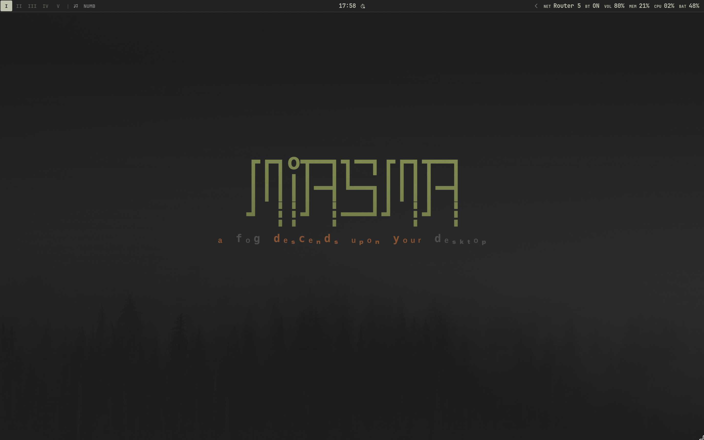

<p align="center">
  
</p>

<div align="center">
  
</div>

<p align="center">
  
  
  
  
</p>

---

## About

Hey there! 👋

Welcome to **linuxdots**! This repo contains my personal dotfiles for **Omarchy** — a beautifully crafted Arch Linux distribution built on **Hyprland**.

This setup transforms Arch into a clean, cohesive, and productive environment with a tiling window manager, custom status bar, thoughtful terminal styling, and carefully curated applications. Everything is managed with **GNU Stow** for easy deployment across machines.

## Features

- 🪟 **Hyprland** tiling window manager with dynamic gaps, blur, and animations
- 🌸 Beautiful **Waybar** status bar with custom styling
- ❄️ **Walker** app launcher
- \>_ Sleek **Ghostty** terminal with custom config
- 🐚 **bash** shell with Starship prompt
- 🎨 **Starship** prompt with minimal, clean design
- ⌨️ **Neovim** (LazyVim) editor config
- 🎯 **Hypridle/Hyprlock** for idle management and lock screen
- 💫 **Fastfetch** and **btop** for system info and monitoring
- 🎵 **Spotify/cliamp** for music
- 🦊 **Zen Browser** with custom userChrome styling
- ⚙️ GNU **Stow** managed dotfiles

---

## Core System Info

| Component | App |
|-----------|-----|
| **OS** | [Omarchy](https://omarchy.org/) (Arch Linux) |
| **WM** | [Hyprland](https://hyprland.org/) |
| **Shell** | [bash](https://www.gnu.org/software/bash/) |
| **Terminal** | [Ghostty](https://ghostty.org/) |
| **Bar** | [Waybar](https://github.com/Alexays/Waybar) |
| **Launcher** | [Walker](https://github.com/abenz1267/walker) |
| **Editor** | [Neovim](https://neovim.io/) (LazyVim) |
| **Monitor** | [btop](https://github.com/aristocratos/btop) |
| **Fetch** | [fastfetch](https://github.com/fastfetch-cli/fastfetch) |
| **Theme** | [Miasma](https://github.com/OldJobobo/omarchy-miasma-theme) (Omarchy) |
| **Font** | [JetBrainsMono Nerd Font](https://www.jetbrains.com/lp/mono/) |

---

## Requirements

Make sure these are installed before using these dotfiles:

- **JetBrainsMono Nerd Font** — [Official page](https://www.jetbrains.com/lp/mono/) (required for Waybar and terminal icons)
- **GNU Stow** — [Arch package](https://archlinux.org/packages/extra/any/stow/) / [GNU website](https://www.gnu.org/software/stow/) (for symlink management)

### Complete System Configuration

> [!NOTE]
> All packages are managed via GNU Stow

<details>

<summary>🪟 <b>System</b></summary>

<br>

| Component | App | Config |
|-----------|-----|--------|
| **OS** | [Omarchy](https://omarchy.org/) (Arch Linux) | — |
| **Window Manager** | [Hyprland](https://hyprland.org/) | [⚙️](hypr/.config/hypr/) |
| **Status Bar** | [Waybar](https://github.com/Alexays/Waybar) | [⚙️](waybar/.config/waybar/) |
| **App Launcher** | [Walker](https://github.com/abenz1267/walker) | [⚙️](walker/.config/walker/) |
| **Notifications** | [Mako](https://github.com/emersion/mako) | Omarchy default |
| **Idle/Lock** | [Hypridle](https://github.com/hyprwm/hypridle) / [Hyprlock](https://github.com/hyprwm/hyprlock) | [⚙️](hypr/.config/hypr/) |
| **OSD** | [SwayOSD](https://github.com/ErikReider/SwayOSD) | Omarchy default |

</details>

<details>

<summary>🖥️ <b>Terminal & CLI</b></summary>

<br>

| Component | App | Config |
|-----------|-----|--------|
| **Shell** | [bash](https://www.gnu.org/software/bash/) | [⚙️](bash/) |
| **Terminal** | [Ghostty](https://ghostty.org/) | [⚙️](ghostty/.config/ghostty/) |
| **Prompt** | [Starship](https://starship.rs/) | [⚙️](starship/.config/starship.toml) |
| **Monitor** | [btop](https://github.com/aristocratos/btop) | Omarchy default |
| **Fetch** | [fastfetch](https://github.com/fastfetch-cli/fastfetch) | [⚙️](fastfetch/.config/fastfetch/) |
| **Git TUI** | [lazygit](https://github.com/jesseduffield/lazygit) | [⚙️](lazygit/.config/lazygit/) |
| **VCS** | [git](https://git-scm.com/) | — |

</details>

<details>

<summary>🖱️ <b>GUI Applications</b></summary>

<br>

| Component | App | Config |
|-----------|-----|--------|
| **Editor** | [Neovim](https://neovim.io/) (LazyVim) | [⚙️](nvim/.config/nvim/) |
| **Browser** | [Zen Browser](https://zen-browser.app/) | — |
| **File Manager** | [Nautilus](https://wiki.gnome.org/Apps/Files) | — |
| **Music** | [Spotify](https://spotify.com/) / [cliamp](https://github.com/cliamp/cliamp) | — |
| **Video Player** | [mpv](https://mpv.io/) | [⚙️](mpv/.config/mpv/) |
| **Notes** | [Obsidian](https://obsidian.md/) | — |
| **Chat** | [Vesktop](https://github.com/Vencord/Vesktop) | — |
| **Passwords** | [Bitwarden](https://bitwarden.com/) | — |

</details>

<details>

<summary>🎨 <b>Customizations</b></summary>

<br>

| Component | Detail |
|-----------|--------|
| **Theme** | [Miasma](https://github.com/OldJobobo/omarchy-miasma-theme) (Omarchy) |
| **Font** | [JetBrainsMono Nerd Font](https://www.jetbrains.com/lp/mono/) |
| **Resolution** | 2880×1800@120 |

</details>

---

## Setup

> [!WARNING]
> These configs are not plug-and-play for every system. Cherry-pick what you need and back up existing configs before applying.

### Quick Start

```bash
git clone git@github.com:skordeanz/linuxdots.git ~/.dotfiles
cd ~/.dotfiles
./restow
```

### Commands

| Command | What it does |
|---------|-------------|
| `./restow` | Re-stow all packages |
| `./restow -n` | Dry run (no changes) |
| `./restow --adopt` | Overwrite stow tree with live configs |
| `stow -Dv <pkg>` | Unstow a package |
| `stow -nv <pkg>` | Dry-run a single package |

### Per-Package Setup

<details>
<summary><strong>🪟 Hyprland</strong></summary><br>

- Ensure [Hyprland](https://hyprland.org/) is installed
- Stow: `stow hypr`
- Configs land in: `~/.config/hypr/`
- Includes: bindings, monitors, animations, idle, lock, input

</details>

<details>
<summary><strong>🌾 Waybar</strong></summary><br>

**NOTE:** Requires a Nerd Font (JetBrainsMono Nerd Font recommended).

- Stow: `stow waybar`
- Configs land in: `~/.config/waybar/`
- Restart after changes: `omarchy restart waybar`

</details>

<details>
<summary><strong>❄️ Walker</strong></summary><br>

- Stow: `stow walker`
- Configs land in: `~/.config/walker/`
- Restart after changes: `omarchy restart walker`

</details>

<details>
<summary><strong>>_ Ghostty</strong></summary><br>

- Stow: `stow ghostty`
- Configs land in: `~/.config/ghostty/`
- Restart after changes: `omarchy restart terminal`

</details>

<details>
<summary><strong>🐚 bash</strong></summary><br>

- Stow: `stow bash`
- Configs land in: `~/.bashrc`, `~/.bash_profile`
- Reload: `source ~/.bashrc`

</details>

<details>
<summary><strong>🎨 Starship</strong></summary><br>

- Install: `omarchy install starship` or `sudo pacman -S starship`
- Stow: `stow starship`
- Config lands in: `~/.config/starship.toml`

</details>

<details>
<summary><strong>⌨️ Neovim</strong></summary><br>

- Install: `sudo pacman -S neovim`
- Stow: `stow nvim`
- Config lands in: `~/.config/nvim/`
- Uses [LazyVim](https://www.lazyvim.org/) as base

</details>

<details>
<summary><strong>📝 Fastfetch</strong></summary><br>

- Stow: `stow fastfetch`
- Configs land in: `~/.config/fastfetch/`

</details>

<details>
<summary><strong>📊 btop</strong></summary><br>

- Install: `sudo pacman -S btop`
- Config managed by Omarchy defaults

</details>

<details>
<summary><strong>📺 mpv</strong></summary><br>

- Stow: `stow mpv`
- Configs land in: `~/.config/mpv/`

</details>

<details>
<summary><strong>🎯 lazygit</strong></summary><br>

- Install: `sudo pacman -S lazygit`
- Stow: `stow lazygit`
- Config lands in: `~/.config/lazygit/`

</details>


---

## ⌨️ Keybindings

Quick reference for Hyprland keybindings:

| Keys | Action |
|------|--------|
| `SUPER + Return` | Open terminal |
| `SUPER + ALT + Return` | Open tmux session |
| `SUPER + SHIFT + Return` | Open browser |
| `SUPER + SHIFT + N` | Open Neovim |
| `SUPER + SHIFT + O` | Open Obsidian |
| `SUPER + SHIFT + M` | Open Spotify |
| `SUPER + SHIFT + F` | Open file manager |
| `SUPER + SHIFT + D` | Open Vesktop (Discord) |
| `SUPER + SHIFT + /` | Open Bitwarden |

Full keybindings in: [`hypr/.config/hypr/bindings.conf`](hypr/.config/hypr/bindings.conf)

---

## Directory Structure

```
.dotfiles/
├── assets/                    # Images and branding
│   ├── desktop.png
│   └── linuxdots.svg
├── bash/                      # Shell config
│   ├── .bashrc
│   └── .bash_profile
├── fastfetch/                 # System fetch config
├── ghostty/                   # Terminal config
├── hypr/                      # Hyprland WM config
│   └── .config/hypr/
│       ├── hyprland.conf      # Main config
│       ├── bindings.conf      # Keybindings
│       ├── monitors.conf      # Display setup
│       ├── looknfeel.conf     # Gaps, borders, animations
│       ├── input.conf         # Input settings
│       ├── hypridle.conf      # Idle behavior
│       ├── hyprlock.conf      # Lock screen
│       └── ...
├── lazygit/                   # Git TUI config
├── mpv/                       # Video player config
├── nvim/                      # Neovim config (LazyVim)
├── starship/                  # Prompt config
├── walker/                    # App launcher config
├── waybar/                    # Status bar config
│   └── .config/waybar/
│       ├── config.jsonc       # Modules and layout
│       └── style.css          # Styling
├── xdg/                       # Default apps and dirs
├── restow                     # Stow helper script
└── README.md
```

---

## License

Feel free to use, modify, and adapt these configurations for your own setup!

<br>

<p align="center">
  <i>Personal dotfiles for Omarchy — Arch Linux with Hyprland</i>
</p>
